#  Bumpy
다이어트를 시작하면서 운동과 식단 내용을 기록할 수 있는 나만의 헬스케어 서비스, Bumpy 입니다.

Bumpy는 울퉁불퉁하다는 뜻으로, 울퉁불퉁한 몸을 만들어 보자는 의미를가지고 있습니다.

## 🚩 기획 배경

2022년 9월 건강문제로 인해 운동을 시작하게 되었습니다. 처음 헬스장에서 PT를 받으면서 어떤 운동을 어떤 무게로 했는지 알려주었고, 이를 정리해서 한 눈에 볼 수 있는 서비스가 있다면 좋겠다라는 생각이 들어 개발을 시작하게 되었습니다.

가장 최근 내가 어떤 운동을 했고, 운동을 하면서 `나의 최고기록`, `한달 평균기록`, `평균 반복횟수`등을 한 눈에 확인할 수 있으며, 내가 한 운동에 관련한 youtube관련 목록도 확인할 수 있습니다.

활동내용을 등록하면 activity달력이 채워지며, 목표 달성을 더욱 고취시킵니다.

Front와 Back 각자 사용해보고 싶었던 기술을 사용해보며, 해당 서비스를 공부 목적으로 시작하였습니다.

## 🤼‍♂️ 개요

* 프로젝트 이름 : Bumpy
* 기술 Stack : Java, Mysql , Nuxt3, ....
* Team 
* 조준형 : Front & 기획, Design, 기타 문서작업
* 이희정 : Back & DB, 배포, 기획 

## 🎯 목표

### Front

* Nuxt3를 사용해보며, 구조 및 Nuxt 이해하기
* Typescript 익숙해지기.
* 문서작업을 하며, 체계적으로 개발 진행해보기

### Back

* 

## ⚙ Project Structure

📦PJT
 ┣ 📂develop
 ┃ ┣ 📂backend			#Backend
 ┃ 	 ┣ 📂src/main/java	#Backend 코드
  ....
 ┃ ┣ 📂frontend			# FrontEnd
 ┃   ┣ 📂bumpy-nuxt3
 ┃ 	   ┣ 📂src			# Front 코드
 ┃ 	     ┣ 📂api		# 통신관련 Method
 ┃ 	     ┣ 📂assets	
 ┃ 	       ┣ 📂scss # CSS 파일
 ┃ 	       ┣ 📂images
 ┃ 	     ┣ 📂components # 관련 컴포넌트
 ┃ 	       ┣ 📂calendar
 ┃ 	       ┣ 📂charts
 ┃ 	       ┣ 📂form  
 ┃ 	       ┣ 📂list
 ┃ 	       ┣ 📂menu
 ┃ 	       ┣ 📂meter
 ┃ 	       ┣ 📂user
 ┃ 	     ┣ 📂layouts # 레이아웃
 ┃ 	     ┣ 📂pages # 페이지들
 ┃ 	     ┣ 📂plugins
 ┃ 	     ┣ 📂public
 ┃ 	     ┣ 📂store # pinia Store
 ┃ 	     ┣ 📂types # type 선언 파일
 ┣ 📂docs				# 문서작업
 ┃ ┣ 📂FlowChart      # Flow Chart
 ┃ ┣ 📂WireFrame    # 와이어 프레임
 ┃ ┣ 📂기능정의        # DB ERD 및 개발 관련 필요 문서들
 ┃ ┣ 📂자료조사	    # 유사 서비스 조사
 ┃ ┣ 📂회의록			# 회의록
 ┗ 📜README.md			# 프로젝트 README

## 👀 Bumpy의 분야별 기능 소개

※ 더 궁금한 화면내용들은 readme_images폴더를 참고해 주세요.

### 👉 메인

| MAIN                                                         |
| ------------------------------------------------------------ |
| 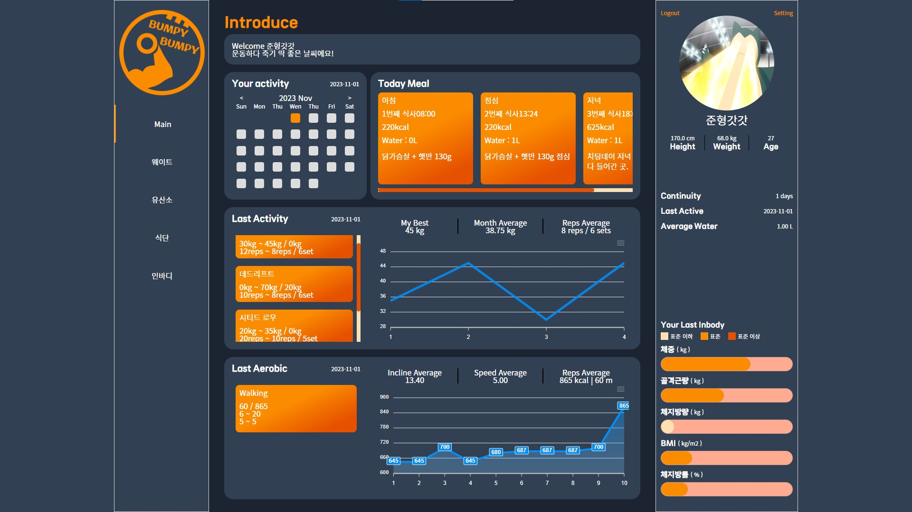                            |
| ● 다양한 정보를 한 눈에 볼 수 있는 화면.  ● 이번 달 운동한 날짜들을 Activity Calendar로 확인할 수 있고, 오늘 등록한 식단의 내용을 확인할 수 있습니다.  ● 최근 웨이트 운동을 한 날짜에 등록한 운동목록들을 보여주며, 해당 운동에 대한 평균값들의 정보를 차트로 보여줍니다.  ● 최근 유산소 운동을 한 날짜에 등록한 운동목록들을 보여주며, 해당 운동에 대한 평균값들의 정보를 차트로 보여줍니다.  ● 우측에는 사용자정보가 나타나며, 신체정보, 연속으로 운동한 일 수, 가장 마지막 운동날짜, 평균 물 섭취량, Inbody정보들을 보여줍니다. |

### 👉 정보 등록 관련

|        | 목록 페이지                                                  | 저장, 수정 페이지                                            | 상세 페이지                                                  |
| :----- | ------------------------------------------------------------ | ------------------------------------------------------------ | ------------------------------------------------------------ |
| 웨이트 |          | 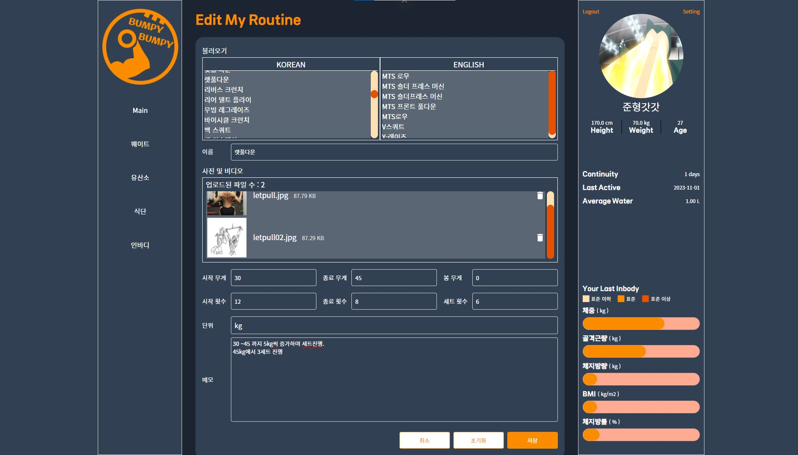         | 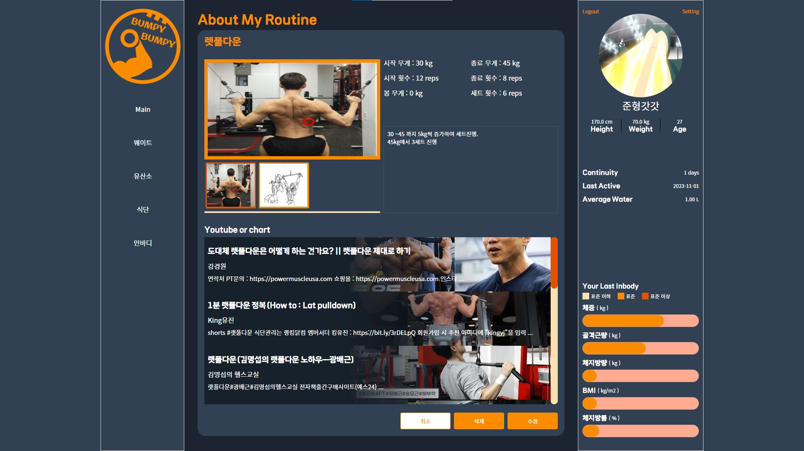     |
|        | ● 웨이트 운동 정보를 확인하는 화면 ● 아이템 클릭 시 상세 페이지로 이동하며, 추가버튼은 당일만 가능합니다. ● 날짜 이동 시 해당 달의 정보를 가져옵니다. | ● 웨이트 운동 정보를 등록 및 수정하는 화면 ● 이전에 등록했던 웨이트 이름목록을 확인할 수 있습니다. ● 운동 사진, 시작과 종료시의 무게, 세트 수, 봉 무게등 운동과 관련된 정보를 입력할 수 있습니다. | ● 웨이트 운동 상세 정보를 확인하는 화면 ● 등록한 사진과 해당 운동에 대한 정보를 확인할 수 있습니다. ● 운동 이름을 keyword로 하여 관련된 유튜브 목록을 확인할 수 있습니다. ● 당일만 삭제 및 수정이 가능합니다. |
| 유산소 | 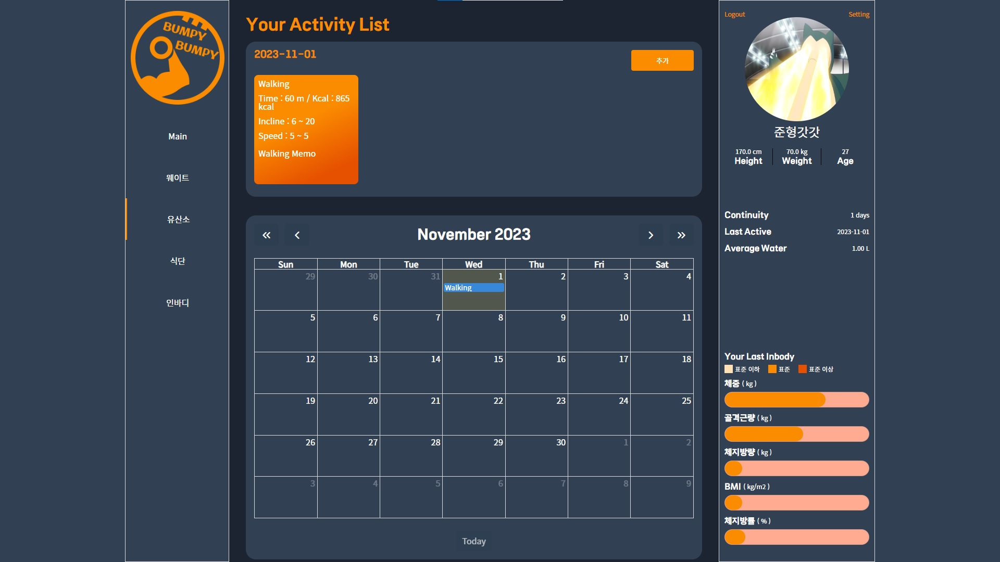      | 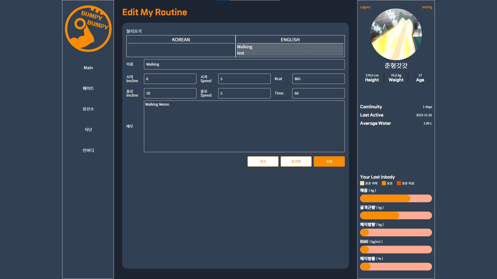      | 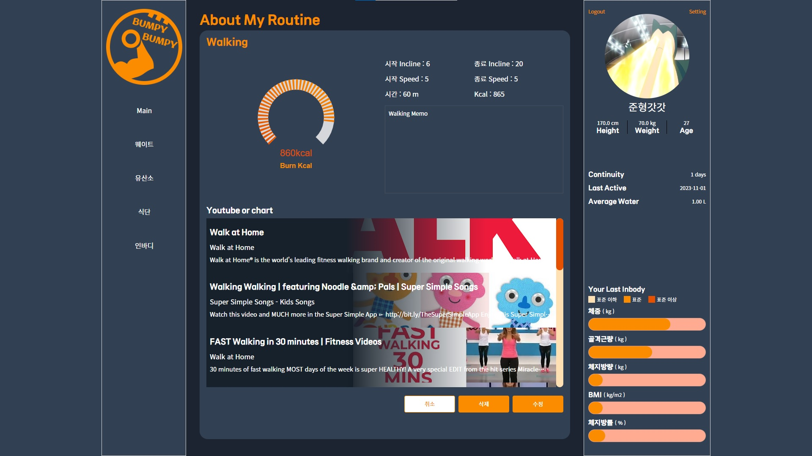  |
|        | ● 유산소 운동 정보를 확인하는 화면 ● 아이템 클릭 시 상세 페이지로 이동하며, 추가버튼은 당일만 가능합니다. ● 날짜 이동 시 해당 달의 정보를 가져옵니다. | ● 유산소 운동 정보를 등록 및 수정하는 화면 ● 이전에 등록했던 유산소 이름목록을 확인할 수 있습니다. ● 시작과 종료시의 Incline, Speed, 소모 Kcal, 시간등 해당 운동에 관한 정보를 입력할 수 있습니다. | ● 유산소 운동 상세 정보를 확인하는 화면 ● 소모kcal에 대한 정도와 해당 운동에 대한 정보를 확인할 수 있습니다. ● 운동 이름을 keyword로 하여 관련된 유튜브 목록을 확인할 수 있습니다. ● 당일만 삭제 및 수정이 가능합니다. |
| 식단   | 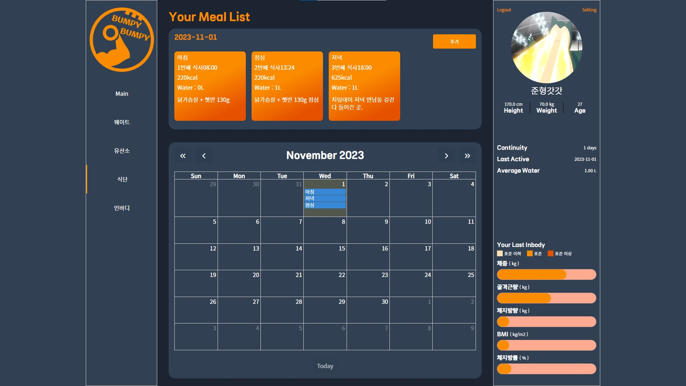               | 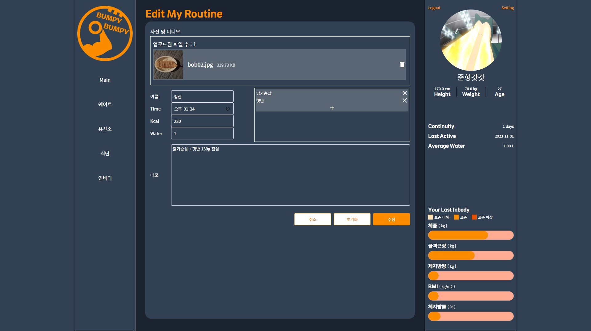               | 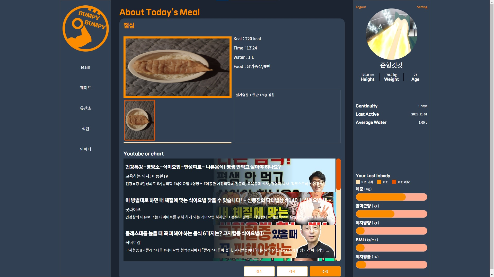           |
|        | ● 식단 정보를 확인하는 화면 ● 아이템 클릭 시 상세 페이지로 이동하며, 추가버튼은 당일만 가능합니다. ● 날짜 이동 시 해당 달의 정보를 가져옵니다. | ● 식단 정보를 등록 및 수정하는 화면 ● 음식 사진과 kcal, 식사시간, 음식목록등 해당 식사에 대한 정보를 입력할 수 있습니다. | ● 식단 상세 정보를 확인하는 화면 ● 등록했던 사진과 식단 정보를 확인할 수 있습니다. ● 식단과 관련된 고정된 keyword리스트 중 하나를 랜덤하게 keyword로 하여 관련된 유튜브 목록을 확인할 수 있습니다. ● 당일만 삭제 및 수정이 가능합니다. |
| 인바디 | 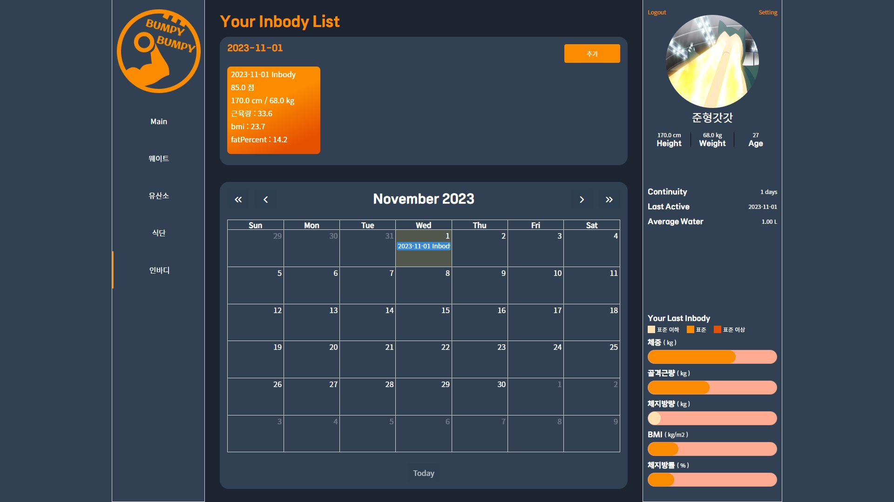         |          |      |
|        | ● Inbody 정보를 확인하는 화면 ● 아이템 클릭 시 상세 페이지로 이동하며, 추가버튼은 당일만 가능합니다. ● 날짜 이동 시 해당 달의 정보를 가져옵니다. | ● Inbody 정보를 등록 및 수정하는 화면 ● Inbody사진과, 키, 체중, 골격근량등 Inbody측정시 나오는 값을 입력할 수 있습니다. | ● Inbody 상세 정보를 확인하는 화면 ● 등록했던 사진과 Inbody정보를 확인할 수 있습니다. ● Inbody와 관련된 고정된 keyword리스트 중 하나를 랜덤하게 keyword로 하여 관련된 유튜브 목록을 확인할 수 있습니다.  ● 당일만 삭제 및 수정이 가능합니다. |

### 👉 회원 관련

| 로그인                                                       | 회원 가입                                                    |
| ------------------------------------------------------------ | ------------------------------------------------------------ |
|                      | 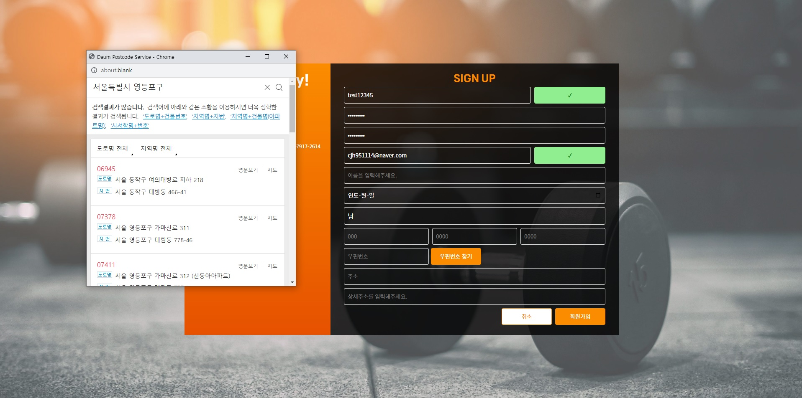             |
| ● 로그인 화면. ● 아이디와 비밀번호 입력 후 로그인이 가능합니다. ● Signup 버튼 클릭으로 회원가입 페이지로 이동합니다. | ● 회원가입 화면. ● 아이디 ,비밀번호, 이메일, 생년월일, 주소등 회원가입에 필요한 정보를 입력합니다. ● 이메일 검증은 아이디 중복체크 후 가능합니다. ● 회원가입 후 로그인 페이지로 이동합니다. |

| 비밀번호 체크                                                | 회원 정보 수정                                               |
| ------------------------------------------------------------ | ------------------------------------------------------------ |
|      | 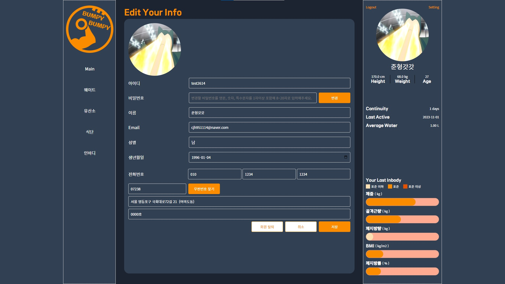           |
| ● 회원정보 수정 전 비밀번호를 확인하는 화면. ● 비밀번호 확인 후 회원 정보 수정 페이지로 이동합니다. | ● 회원정보 수정 화면. ● 첫 진입시 비밀번호를 제외한 회원의 정보가 입력된 상태입니다. ● 비밀번호는 변경버튼을 클릭시 활성화되어 입력이 가능합니다. |

