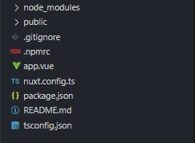

# 🐳 00_Nuxt 라우팅 & custom-layout 설정

## 🤔 문제 상황

Nuxt3 프로젝트를 생성했을 때 Nuxt2처럼 기본으로 생성되는 파일이 몇 개 없었음.


## 🚩 해결 방안

pages폴더를 생성하여 경로에 맞게 파일을 생성.

파일의 이동은 NuxtLink의 to속성을 이용.


## 🔍 관련 Study

### 👉 Routing

Nuxt의 핵심 기능 중 하나로 파일 시스템 라우터이다.

디렉토리 내 모든 Vue파일은 `pages/`파일의 내용을 표시하는 URL을 생성한다.


### 👉 Pages

Nuxt라우팅은 **vue-router를 기반**으로 하며 파일 이름을 기반으로 `pages/`디렉터리에 생성된 모든 구성 요소에서 경로를 생성함.

**이름 지정 규칙**을 이용해 동적 및 중첩 경로를 생성함.

```text
// pages/ directory
pages/
--| about.vue
--| posts/
----| [id].vue
```

```text
// 생성된 Router 파일
{
  "routes": [
    {
      "path": "/about",
      "component": "pages/about.vue"
    },
    {
      "path": "/posts/:id",
      "component": "pages/posts/[id].vue"
    }
  ]
}
```


### 👉 Nuxt3 프로젝트 생성

**생성된 Nuxt3 파일들을 보고**



Nuxt3에서는 `pages/`폴더가 **옵션**이다.

why? 프로젝트에 따라 페이지 라우팅이 필요 없는 경우, `pages/`폴더를 만들지 않으면 **`vue-router`에  결과물을 포함시키지 않게되서 용량을 줄일 수 있기 때문**.


생성된 파일에 `tsconfig.json`이 생성되있는걸로 봐서 `typescript`가 기본 언어.


### 👉 Modules

공식 홈페이지에서 여러 Module들을 지원하는 것을 확인 할 수 있다.

필요한 모듈들은 적극 활용하는게 좋을 듯 하다.

**Read more** : [Nuxt3 Modules](https://nuxt.com/modules)


### 👉 Page 및 Layout 변경점

**app.vue**

Nuxt는 app.vue가 소스 티렉토리에 없으면, 자체 기본 버전을 사용합니다.


**layout**

Nuxt3에서는 레이아웃대신 슬롯을 사용한다.

**Read more** : [Nuxt3 공식문서 - layout](https://nuxt.com/docs/guide/directory-structure/layouts)

 추가적으로, 레이아웃을 정의할때 `definePageMeta`를 사용해야하며, 레이아웃은 **kebab-case**다.

`layouts/customLayout.vue` -> `custom-layouts`


**정리**

* `<Nuxt /> ` -> `<slot />`
* 레이아웃 정의 시 `definePageMeta` 이용
* `~/layouts/_error.vue` -> `~/error.vue`로 이동.


## 📘 참고

* [Nuxt3 공식문서 - Routing](https://nuxt.com/docs/getting-started/routing)
* [Nuxt3 공식문서 - Modules](https://nuxt.com/modules)
* [Nuxt3 공식문서 - Migration](https://nuxt.com/docs/migration/overview)
* [Nuxt3 공식문서 - layout](https://nuxt.com/docs/guide/directory-structure/layouts)
* [Nuxt3 프로젝트 만들기 blog글](https://www.peterkimzz.com/nuxt3-sideproject-2/)
* [Migrating from Nuxt 2 to Nuxt 3](https://debbie.codes/blog/migrating-nuxt2-nuxt3/)
