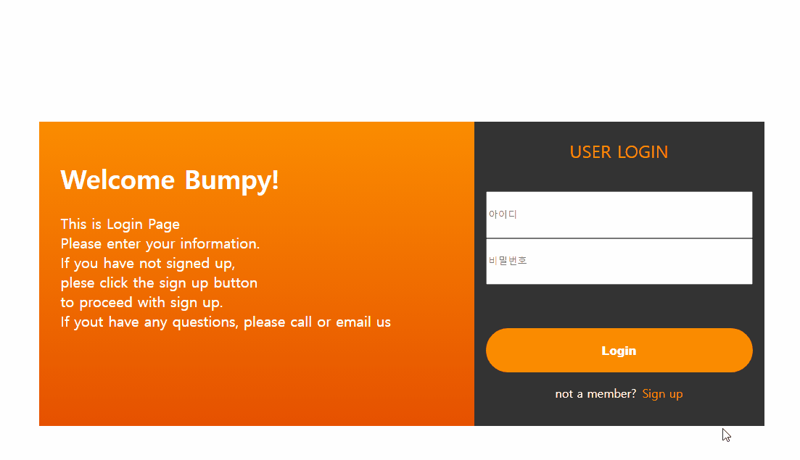

# 🐳 01_form태그 action속성과 onSubmit

## 🤔 문제 상황

Login Button에 라우터 이동 메소드를 추가할 때 이동하지 않는 현상이 발생.


## 🚩 해결 방안

action에 적용할 target변수와 submit의 메서드를 따로 두고, 수정


## 🔍 관련 Study

### 👉 Action

form데이터를 처리할 프로그램의 URI를 지정한다.

URI는 하나의 리소스를 가리키는 문자열이다.

action에 웹 문서 링크를 문자열 형태로 작성한 다음 form 데이터를 전송하게 되면, 브라우저의 라우트(route)가 해당 웹 문서로 이동하는 것을 확인할 수 있다.

action에 서버 사이드 언어인 php나 jsp로 작성한 문서를 지정해 데이터를 처리하도록 하는것도 가능.


### 👉 onSubmit

**양식 제출 이벤트가 발생할 때의 동작을 지정한다.**

form태그 내부에서 `<input type="submit">`로 인해 발생하는 이벤트를 처리할 수 있다.

action에 지정된 URL이 적용되는 그 사이 시점에 처리할 동작을 이 onSubmit속성을 통해 지정할 수 있는 것.


### 👉 적용

action에 적용할 변수와 submit의 메서드를 따로 두고, 수정

moveMain에서 id와 pw가 같은지만 검사하여, 이동하도록 테스트.

(비밀번호는 임시로 text로 바꾸어 테스트 진행)

```vue
<form class="login-form" :action="target" @submit="moveMain(formData)">
    <input type="text" placeholder="아이디" v-model="formData.id"/>
    <input type="password" placeholder="비밀번호" v-model="formData.pw" />
    <input type="submit" class="long-filled-button login-button" value="Login"/>
    <p class="move-sign-up-wrap-box">not a member? 
        <NuxtLink to="/signin" class="text-button bp-ml-sm">Sign up</NuxtLink>
    </p>
</form>
...
<script setup lang="ts">
interface userFormData {
  id: string,
  pw: string,
}
const formData:userFormData = {
  id: '',
  pw: '',
}
const target = ref('#');
const moveMain = (formData: userFormData) => {
  console.log(formData.id , formData.pw);
  console.log(formData.id === formData.pw);
  target.value = formData.id === formData.pw ? 'main' : '#';
  return formData.id === formData.pw;
};
</script>
```

**결과 사진**




## 📘 참고

* [form action과 onsubmit차이](https://kindle14.tistory.com/57)
* [MDN form](https://developer.mozilla.org/ko/docs/Web/HTML/Element/form)
* [MDN Events](https://developer.mozilla.org/ko/docs/Learn/JavaScript/Building_blocks/Events)

* [MDN input submit](https://developer.mozilla.org/en-US/docs/Web/HTML/Element/input/submit)