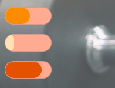

# 🐳 02_progress와 meter Custom

## 🤔 문제 상황

수치에 따라 정도를 나타내는 컴포넌트 개발을 하며, progress와 meter tag에 대해 공부.


## 🚩 해결 방안

~~progress태그를 이용하여 개발~~

=> meter tag를 이용하여 개발 test


## 🔍 관련 Study

### 👉 Progress Tag 

Progress는 진행 정도를 나타내는 바를 만드는 태그.


**Attribute**

max와 value 2가지만 존재

전체를 max로 봤을떄 value가 어느 정도인지 나타난다.

**최소값은 항상 0이며, min 속성이 없다.**


**Custom Style**

progress를 그냥 수정했을 때 오류가 발생했었다.

방법을 찾아보니 `-webkit-progress-bar`와 `-webkit-progress-value`로 각각 전체 바와 게이지에 해당하는 부분을 수정했어야 했습니다.

value에 따라 게이지의 색을 변경해주기 위해, value별로 다른 class를 적용하도록 개발하였습니다.

```vue
<template>
  <div class="progress-bar">
    <progress :value="value" :max="max" 
              :class="{'high-level': value>70, 'middle-level': value<=70 && value>50, 'low-level': value<=50}"></progress>
  </div>
</template>
```


### 👉 Meter Tag

분수 값이나 게이지 내에서 특정 스칼라 값이 어느 정도인지를 표현할 때 사용함.

(사용량, 비율, ...)


**Attribute**

+ form : meter요소가 포함될 하나 이상의 form 요소를 명시
+ high : 높은 값으로 간주되는 범위
+ low : 낮은 값으로 간주되는 범위
+ max : 게이지의 최대값
+ min : 게이지의 최소값
+ optimum : 게이지의 최적값
+ value : **필수 속성**으로 게이지의 현재 또는 측정된 값을 명시


**Custom Style**

Custom방법은 progress tag와 비슷하였습니다.

* `-webkit-meter-bar` : meter전체 bar의 style
* `-webkit-meter-optimum-value` : meter 최적값 색상(low ~ high)
* `-webkit-meter-suboptimum-value` : meter 최적값에 근접한 색상 (high 이상)
* `-webkit-meter-even-less-good-value` : meter최적값에서 부족한 색상 설정(low 이하)

```scss
meter{
    ...
    // 최적값 아래
    &::-webkit-meter-even-less-good-value {
      border-radius: 1rem;
      background-color: $low-point-color;
    }
    // 최적값
    &::-webkit-meter-optimum-value{
      border-radius: 1rem;
      background-color: $high-point-color;
    }
  
    // 최적값 근접
    &::-webkit-meter-suboptimum-value{
      border-radius: 1rem;
      background-color: $middle-point-color;
    }
}
```


### 👉 적용

처음에 Progress태그를 이용해 컴포넌트를 init했지만, meter로 변경해야함.

위 속성들을 받는 meter태그를 만들고, css적용.

```vue
<template>
...
	<MeterBar :value="55" :max="100" :min="0" :low="30" :high="68" :optimum="100" class="bp-my-sm"></MeterBar>
    <MeterBar :value="20" :max="100" :min="0" :low="30" :high="68" :optimum="100" class="bp-my-sm"></MeterBar>
    <MeterBar :value="80" :max="100" :min="0" :low="30" :high="68" :optimum="100" class="bp-my-sm"></MeterBar>
...
</template>
```


**결과 사진**




## 📘 참고

* [MDN progress tag](https://developer.mozilla.org/en-US/docs/Web/HTML/Element/progress)
* [MDN meter tag](https://developer.mozilla.org/en-US/docs/Web/HTML/Element/meter)
* [about progress](https://www.codingfactory.net/11010)
* [TCPSchool meter tag](http://www.tcpschool.com/html-tags/meter)
* [Custom meter tag](https://rgy0409.tistory.com/4772)
* [W3Docs meter tag pseudo-class](https://www.w3docs.com/learn-html/html-meter-tag.html)

* [W3Docs progress tag pseudo-class](https://www.w3docs.com/learn-html/html-progress-tag.html)