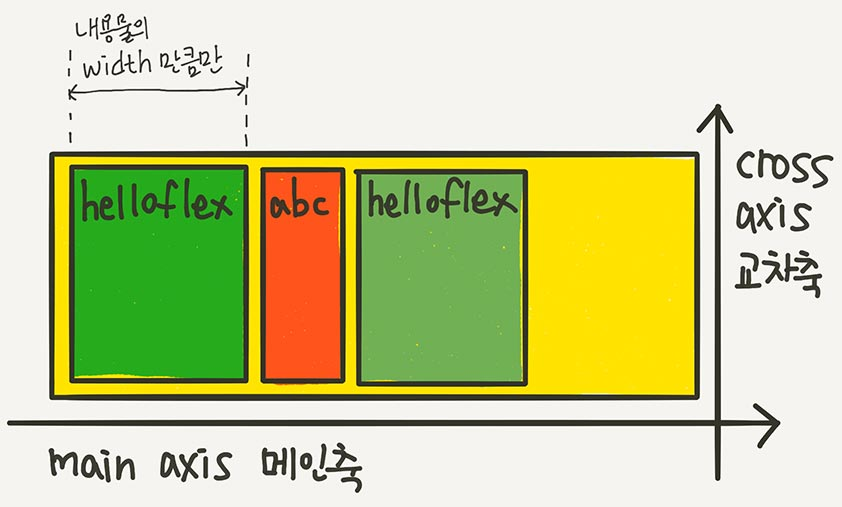

# 🐳 06_Flex

## 🤔 문제 상황

CSS Flex에 대해 정확히 알고 가기

## 🚩 해결 방안

### 결론

- display:flex;
- flex-direction
- flex-wrap 
- justify-content
- align-items
- align-content
- flex-basis
- flex-grow
- flex-shrink
- flex
- align-self
- order


## 🔍 관련 Study

```html
<div class="container">
	<div class="item">FlexItem01</div>
	<div class="item">FlexItem02</div>
	<div class="item">FlexItem03</div>
</div>
```

부모 요소(.container)를 `Flex Container`

자식 요소(.item)들이 `Flex Item`

`컨테이너가 Flex의 영향을 받는 전체 공간이고, 설정된 속성에 따라 각각 아이템들이 어떤 형태로 배치 되는 것`


Flex의 속성들은 2가지로 나뉜다.

* 컨테이너에 적용하는 속성
* 아이템에 적용하는 속성

### 👉 Flex Container에 적용하는 속성들

**display: flex**

flex컨테이너에 display:flex를 적용.

가로방향으로 배치되고, 자신이 가진 내용물의 width만큼 차지함.

height는 컨테이너 높이만큼 늘어남.




### 👉 flex-direction - 배치 방향 설정 

아이템이 배치되는 축의 방향을 결정하는 속성

* flex-direction: row
* flex-direction: column
* flex-direction: row-reverse
* flex-direction: column-reverse


### 👉 flex-wrap - 줄넘김 처리 설정

컨테이너가 아이템을 한 줄에 다 담지 못할 때 줄바꿈처리를 어떻게 할지 결정

* flex-wrap: nowrap (default)
* flex-wrap: wrap
* flex-wrap: wrap-reverse


### 👉 flex-flow - 줄넘김 처리 설정

`flex-direction`과 `flex-wrap`을 한번에 지정할 수 있는 **단축 속성**

```css
.container{
    flex-flow: row wrap;
    /*아래 두 줄과 같다.*/
    /*flex-direction: row;*/
    /*flex-wrap: wrap;*/
}
```


### 👉 justify-content - 메인축 방향 정렬

메인축 방향으로 아이템들을 정렬하는 속성

* justify-content: flex-start;<br/>아이템들을 시작점으로 정렬
* justify-content: flex-end;<br/>아이템들을 끝점으로 정렬
* justify-content: center;<br/>아이템들을 가운데로 정렬
* justify-content: space-between;<br/>아이템들 사이에 균일한 간격을 만들어 줍니다.
* justify-content: space-around;<br/>아이템들 둘레에 균일한 간격을 만들어줌.
* justify-content: space-evenly;<br/>아이템들 사이와 양 끝에 균일한 간격을 만들어줌 (IE와 Edge는 X)


### 👉 align-itmes - 수직축 방향 정렬

수직축 방향으로 아이템들을 정렬하는 속성

* align-items: stretch; (default) <br/>수직축 방향으로 끝까지 늘어남
* align-items: flex-start; <br/>아이템들을 시작점으로 정렬
* align-items: flex-end;<br/>아이템들을 끝점으로 정렬
* align-items: center;<br/>아이템들을 가운데로 정렬
* align-items: baseline;<br/>아이템들을 텍스트 베이스라인 기준으로 정렬


### 👉 align-content - 여러 행  정렬

`flex-wrap: wrap`이 설정되있는 상태에서, 아이템들의 행이 2줄 이상 되었을 때 수직축 방향 정렬을 결정하는 속성

* align-content: stretch;<br/>
* align-content: flex-start;<br/>
* align-content: flex-end;<br/>
* align-content: center;<br/>
* align-content: space-between;<br/>줄 사이 간격을 줌
* align-content: space-around;<br/>둘레에 균일한 간격을 줌
* align-content: space-evenly;<br/>


### 👉 Flex 아이템에 적용하는 속성들

### 👉 flex-basis - 유연한 박스의 기본 영역

Flex아이템의 기본 크기를 설정.<br/>(direction이 row면 너비를, column이면 높이를)


### 👉 flex-grow - 유연하게 늘리기

flex-basis값보다 커질 수 있는지를 결정하는 속성

0보다 큰 값이 세팅되면 flexible한 박스로 변하고, 원래 크기보다 커지며 빈 공간을 메우게 됨.

기본 값은 0

flex-basis를 제외한 **여백** 부분을 flex-grow에 **지정된 숫자의 비율**로 나누어 가진다 생각.


### 👉 flex-shrink- 유연하게  줄이기

flex-grow의 반대로 작아질 수 있는지를 결정하는 속성

0보다 큰 값이 세팅되면 해당 아이템이 Flexible 박스로 변하고 flex-basis보다 작아짐.

(기본값이 1이기 때문에 따로 세팅하지 않아도 basis보다 작아질 수 있었다.)


### 👉 flex

`flex-grow`, `flex-shrink`, `flex-basis`의 축약 표현


### 👉 align-self - 수직축으로 아이템 정렬

align-items가 전체 아이템의 수직축 방향 정렬이라면, 

align-self는 해당 아이템의 수직축 방향 정렬.

* align-self: auto;
* align-self: stretch;
* align-self: flex-start;
* align-self: flex-end;
* align-self: center;
* align-self: baseline;

align-self는 align-items보다 우선권이 있다.<br/>전체 설정보다 개별 설정이 우선한다는 것.


### 👉 order - 배치 순서

시각적 나열 순서를 결정하는 속성.

❗ 보여지는 시각적인 순서일 뿐 HTML구조를 바꾸는 것은 아니니 접근성 측면에서 사용에 주의!


## 📘 참고

[이번에야말로 CSS Flex를 익혀보자 - Flex 정리 블로그](https://studiomeal.com/archives/197)