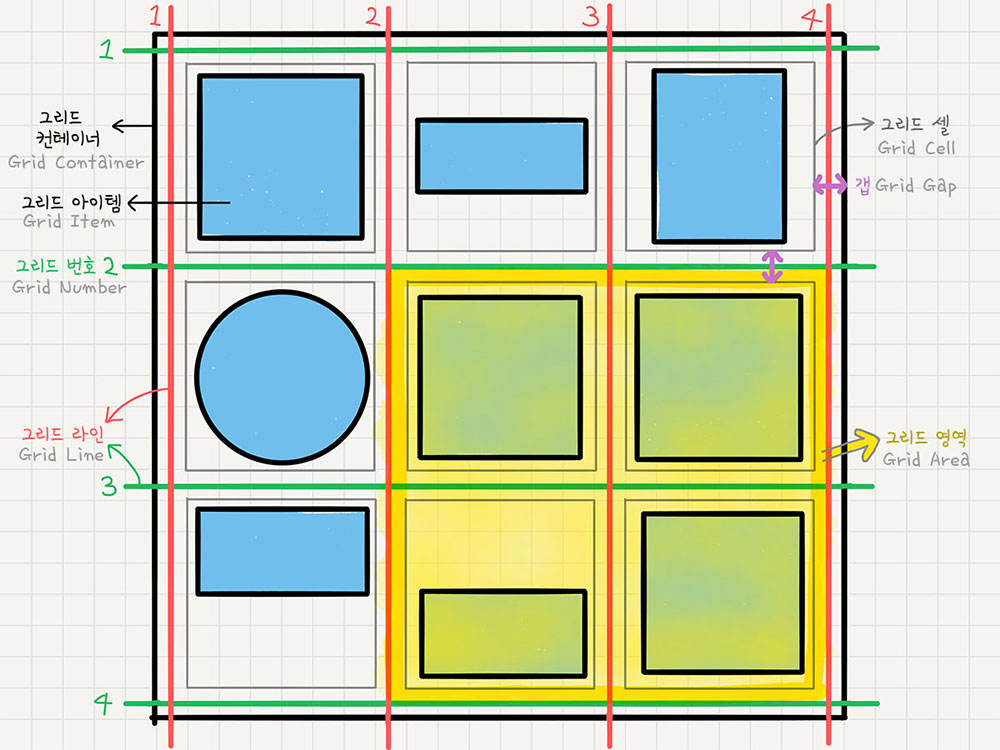
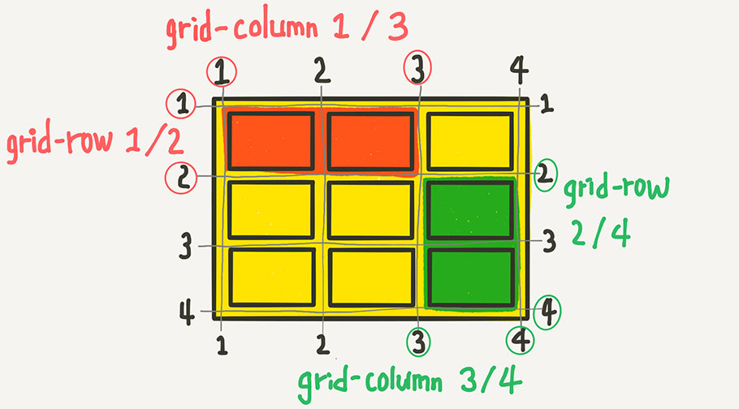
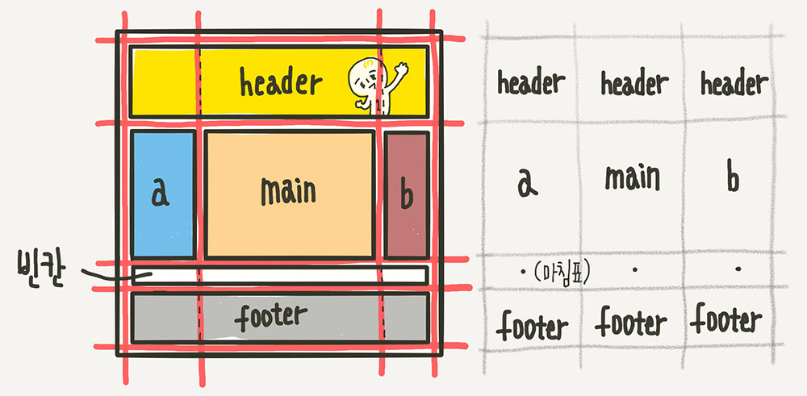

# 🐳 07_Grid

## 🤔 문제 상황

CSS Grid에 대해 정확히 알고 가기

## 🚩 해결 방안

### 결론


## 🔍 관련 Study

### 👉 About Grid

쉽게생각해서 Flex는 1차원, Grid는 2차원.

```html
<div class="container">
	<div class="item">A</div>
	<div class="item">B</div>
	<div class="item">C</div>
</div>
```

부모 요소(.container)를 `Grid Container`

자식 요소(.item)들이 `Grid Item`

`컨테이너가 Grid의 영향을 받는 전체 공간이고, 설정된 속성에 따라 각각 아이템들이 어떤 형태로 배치 되는 것`



* **Grid Container**
  * Grid의 전체 영역
  * Grid 컨테이너 안의 요소들이 Grid규칙의 영향을 받아 정렬된다고 생각하면 된다.
* **Grid Item**
  * Grid 컨테이너 자식 요소들
  * Grid 규칙에의 해 배치된다.
* **Grid Track**
  * Grid의 행 또는 열
* **Grid Cell**
  * Grid의 한 칸을 가리키는 말.
* **Grid Line**
  * 그리드 셀을 구분하는 선
* **Grid Number**
  * Grid 라인의 각 번호
* **Grid Gap**
  * Grid셀 사이 간격
* **Grid Area**
  * Grid라인으로 둘러싸인 사각형 영역
  * 셀의 집합.

flex와 마찬가지로 2가지 속성 존재

* 컨테이너에 적용하는 속성
* 아이템에 적용하는 속성


### 👉 display: grid

Grid 컨테이너에 display: grid;를 적용하는것으로 시작

아이템들이 block요소라면 딱히 변화는 없다.


### 👉 grid-template-rows & grid-template-columns - 그리드 형태 정의

Grid 트랙의 크기들을 지정해주는 속성

* grid-template-rows : 행의 배치
* grid-template-columns : 열의 배치

```css
.container {
	grid-template-columns: 200px 200px 500px;
	/* grid-template-columns: 1fr 1fr 1fr */
	/* grid-template-columns: repeat(3, 1fr) */
	/* grid-template-columns: 200px 1fr */
	/* grid-template-columns: 100px 200px auto */

	grid-template-rows: 200px 200px 500px;
	/* grid-template-rows: 1fr 1fr 1fr */
	/* grid-template-rows: repeat(3, 1fr) */
	/* grid-template-rows: 200px 1fr */
	/* grid-template-rows: 100px 200px auto */
}
```

fr은 fraction의 줄임말로, 숫자 비율대로 트랙의 크기를 나눈다.

```css
grid-template-columns: 100px 2fr 1fr
```

이 경우 좌측 100px 가운데 2 우측 1의 비율로 움직임.


####  repeat 함수

**repeat(반복횟수, 반복값)**

```css
.container {
	grid-template-columns: repeat(5, 1fr);
	/* grid-template-columns: 1fr 1fr 1fr 1fr 1fr */
}
```

반복되는 값을 자동으로 처리


#### minmax함수

최소값과 최대값을 지정하는 함수

```jsx
.container {
	grid-template-columns: repeat(3, 1fr);
	grid-template-rows: repeat(3, minmax(100px, auto));
}
```

`minmax(100px, auto)`의 경우 최소 100px 최대는 자동으로 늘어나도록 처리해준다는 뜻


#### auto-fill과 auto-fit

column의 개수를 미리 정하지 않고 설정된 너비가 허용하는 한 최대한 셀을 채움.


### 👉 row-gap & column-gap & gap - 간격 만들기

그리드 셀 사이의 간격을 설정

gap은 row-gap과 column-gap의 단축 속성


### 👉 grid-auto-columns & grid-auto-rows - 그리드 형태를 자동으로 정의

grid-template-column(or grid-template-rows)의 통제를 벗어난 위치에 있는 트랙 크기를 지정하는 속성


### 👉 각 셀의 영역 지정

* grid-column-start
* grid-column-end
* grid-column
* grid-row-start
* grid-row-end
* grid-row



`grid-column-start : 1; grid-column-end: 3`이 되면, 주황색 까지 병합된 넓이를 가진다.

```css
.item:nth-child(1) {
	grid-column-start: 1;
	grid-column-end: 3;
	grid-row-start: 1;
	grid-row-end: 2;
}
```

```css
.item:nth-child(1) {
	grid-column: 1 / 3;
	grid-row: 1 / 2;
}
```

시작번호 / 끝번호를 지정하는 방법외에 몇개 셀을 차지할 것인지 지정할 수도 있다.

```css
.item:nth-child(1) {
	/* 1번 라인에서 2칸 */
	grid-column: 1 / span 2;
	/* 1번 라인에서 3칸 */
	grid-row: 1 / span 3;
}
```


### 👉 grid-template-areas - 영역 이름으로 그리드 정의

각 영역(Grid Area)에 이름을 붙이고, 그 이름을 이용해서 배치하는 방법



```css
.container {
	grid-template-areas:
		"header header header"
		"   a    main    b   "
		"   .     .      .   "
		"footer footer footer";
}
```


### 👉 grid-auto-flow - 자동 배치

아이템이 자동 배치되는 흐름을 결정하는 속성

* row
* column
* dense
* row dense
* column dense


### 👉 align-items - 세로 방향 정렬

* align-items: stretch;
* align-items: start;
* align-items: center;
* align-items: end;


### 👉 justify-items - 가로 방향 정렬

* justify-items: stretch;
* justify-items: start;
* justify-items: center;
* justify-items: end;


### 👉 place-items

`align-items`와 `justify-items`를 같이 쓸 수 있는 단축 속성

```css
.container {
	place-items: center start;
}
```


### 👉align-content  - 아이템 그룹 세로 정렬

Grid 아이템들의 높이를 모두 합한 값이 Grid 컨테이너 높이보다 작을 때 Grid 아이템들을 통쨰로 정렬함.

* stretch
* start
* center
* end
* space-between
* space-around
* space-evenly


### 👉 justify-content - 아이템 그룹 가로 정렬

Grid아이템들의 너비를 모두 합한 값이 Grid 컨테이너 너비보다 작을 떄 Grid 아이템들을 통쨰로 정렬함.

* stretch
* start
* center
* end
* space-between
* space-around
* space-evenly


### 👉place-content

`align-content`와 `justify-content`의 단축 속성


### 👉 align-self - 개별 아이템 세로 정렬

아이템을 세로방향으로 정렬

* stretch
* start
* center
* end


### 👉 justify-self - 개별 아이템 가로 정렬

아이템을 가로방향으로 정렬

* stretch
* start
* center
* end


### 👉place-self

align-self와 justify-self를 같이 쓸 수 있는 단축 속성

## 📘 참고

[이번에야말로 CSS Grid를 익혀보자 - Grid 정리 블로그](https://studiomeal.com/archives/533)