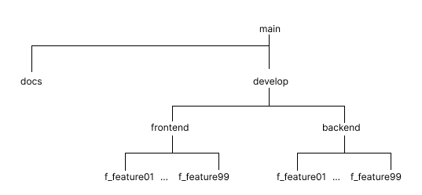

# 📑 2023-01-28 회의록

## 🌏 브랜치 관리

## 🌏 Convention

### 👉 브랜치명

* f_{기능명}

### 👉 Commit Summary

- {feat/fix/docs} : {설명}
- feat : 기능 추가
- fix : 기존 기능 수정 / 삭제
- docs : 문서 작업
- 설명 : where, what

### 👉 Description

- 자유롭게 작성

### 👉 Merge

- Develop까지는 자유롭게
- Main은 주기적으로 (1주일)

## 🌏 Docs

**예상 문서 목록**

- 소개 페이지
- 시장조사
- 용어 사전
- 회의록
- 기능정의서
- 유저플로우
- 와이어프레임
- 화면레이아웃
- ERD 그래프
- 기능별 플로우

## 🌏 기능결정사항

### 👉 01. 회원가입

- 아이디 (유니크)*
- 이름*
- (생년월일)나이*
- 이메일 (인증)*
- 주소
- 휴대폰번호 (미인증, 미사용)

### 👉 02. 로그인

- 아이디
- 비번

### 👉 03. 메인 페이지 (대시보드)

- 목표 (미설정시 설정 가능)
- 잔디 (금일운동여부, 연속 #일)
- 몸상태(가제) - 인바디 요약내용 (체중, 골격근량, 체지방률, 인바디점수, 검사일시) + 캡처사진(미정), 사진들(날짜Sorting)
- 형식상 공지사항

### 👉 04. 기록 (운동, 식단, 인바디)

**운동 - 웨이트**

- 운동이름
- 무게, 봉무게
- 세트수
- 세트당 횟수
- 메모
- 영상(운동)

**운동 - 유산소**

- 운동이름 - walk | run | cycle | 그외 + 입력
- walk, run => incline, kcal, time, speed
- cycle => level, kcal, time, speed
- 그외 => 세트수, 세트당횟수
- (추가적인 머신 발생시 항목추가하는걸로)

**식단**

- 첫끼 둘째끼 셋째끼 + a (끼니수 표시는 유동적)
- 이름
- 시간
- 사진
- kcal

**몸상태(가제)**

- 인바디 요약내용 (체중, 골격근량, 체지방률, 인바디점수, 검사일시) + 캡처사진(미정), 사진들

### 👉 05. 회원정보 (변경, 탈퇴)

- 아이디
- 비번 (빈칸, 입력가능)
- 이름
- 생년월일
- 이메일
- 주소 (입력가능)
- 휴대폰번호 (입력가능)

### 👉 06. 공지사항

- 글번호
- 제목
- 작성자
- 등록날짜
- 내용
- 기능 (검색, 페이지네이션)

## 🌏 고려 사항

### 👉 시장조사, 비교 (한다면)

- 다짐(多Gym) - 운동시설 가격비교앱
- 플릭 - 운동일지
- 피에트
- 홈트레이닝
- 바디 캘린더
- 번핏

### 👉 사용대상

- 20대 ~ 40대, ...?

### 👉 운동범위

- 웨이트, 유산소 (운동별로 구분하기에는 너무 방대하므로)

### 👉 시작페이지

- 로그인 (기능의 대부분이 개인정보와 관련되어 있으므로)

## 🌏 추후 추가 가능 리스트

- 위치 정보. - 주변 운동시설 확인.
- 추천 영상
- 타이머
- 음식구매
- 커뮤니티성 게시판
- 관리자
- QnA, 문의사항
- 소셜로그인
- 다크모드

## 🌏 TODO LIST

**이희정**

- DB 설계
- 시장조사 - 기록하는 방식과 기록된 데이터를 표시하는 방식이 어떠한지 조사해오기 (+메인(대시보드)는 어떻게 표시하는지) 운동관련 제외 앱들로 조사해보기

**조준형**

- 운동일지 및 운동 관련 데이터 표시 형태 조사
- 데이터 정리