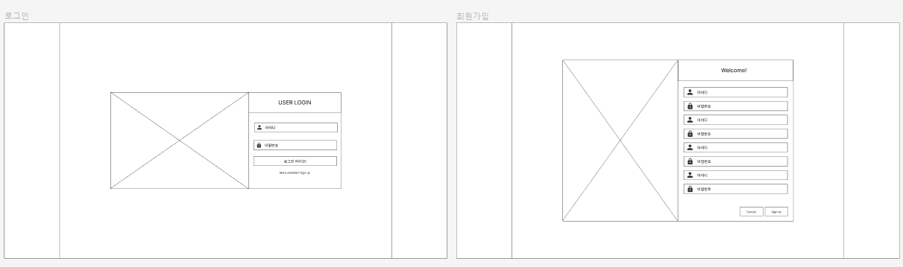
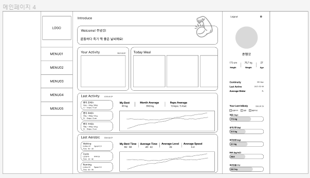

# 📑 2023-02-13 회의록

## 🌏 진행상황 공유

* aws에 리눅스만 올려서 docker까지 설치.
* wireframe(web) 작성 완료

## 🌏 WireFrame에서 결정사항

### 👉 1. 회원가입 & 로그인

- 성별 추가

- 로그인 및 회원가입은 1번 형태로 진행

  

### 👉 2. 메인 페이지

- 로그아웃은 사용자 정보쪽 위치(우측 상단)

- 레이아웃은 4번 

  

### 👉 3. 기록

- 당일에만 등록, 수정, 삭제 가능 (잔디의 의미를 생각해서)
- 과거 날짜의 경우 읽기만 가능.
- 입력값들에 start와 end로 범위입력되게 변경.
- 단위 선택되게 수정.
- 필요시 저장할 때 단위변환 및 계산로직 추가.(kg->파운드 또는 BMI계산)
- 식단등록에 water 추가.
- 식단 등록에서 이름은 해당 item의 이름 ( ex)  ㅇㅇ아침식사 )을 의미하게, 어떤걸 먹었는지 따로 리스트 추가. 
- 웨이트, 유산소, 식단, 인바디 모두 최대한 동일한 형태로 레이아웃 구성.
- Calendar의 날짜 선택을 통해 위쪽 데이터를 변경하여 과거날짜 조회.
- 인바디의 경우 날짜당 1개인 경우가 대부분일 거라 생각하여 미니 상세페이지느낌의 내용을 위쪽에 배치. (해당 클릭 시 상세 페이지로 가는 것은 동일)

### 👉 4. 회원 정보 

- 수정버튼을 통해 on/off보다는 화면 오자마자 수정 가능한 형태 또는 수정 하려는 항목 우측에 버튼 생성
- 비밀번호 변경과 이메일 변경의 경우 하단 버튼 배치 하단 버튼 구성 : 비밀번호 변경, 이메일 변경, 회원탈퇴, 저장.
- 이메일 변경의 경우 인증 절차를 다시 수행.

### 👉 5. 공지사항

* plus로 제외.

## 🌏 TODO LIST

**이희정**

- db, 인증등 개발을 하면서 table만 올리면 될 수준까지 정비.

**조준형**

- 와이어 프레임 수정.
- flow차트 (최대한)
- 데이터 정리

**공통**

* 폰트 (둥근 폰트)
* 포인트 컬러
* 테마