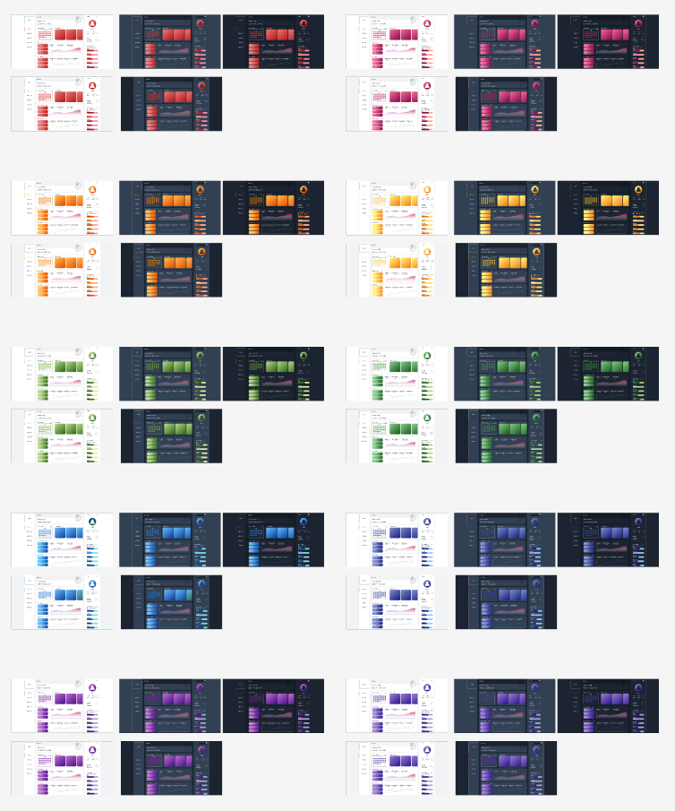
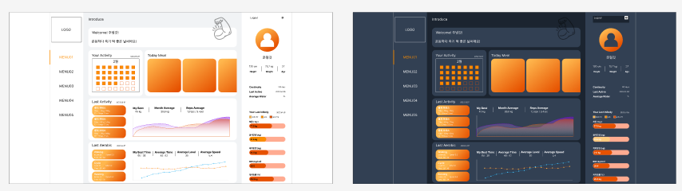
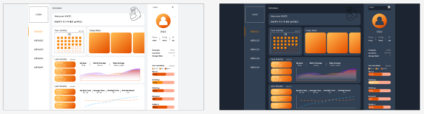

# 📑 2023-02-25 회의록

## 🌏 진행상황 공유 및 결정사항

### 👉 Backend

* backend 기본환경 세팅
  * MariaDB
  * Springboot 3.03, JPA Swagger3의 호환성 문제로 Spring 3.0이상 사용

* api목록 초안 작성
* 이메일 인증관련 추가 확인 필요.
  * 장성 중인 경우 위조 가능성 때문.
  * ex) 같은 이메일을 인증하는 경우
  * 인증받고 수정된 이메일을 보내는 경우

* 메인페이지 불러오는 데이터의 기준 결정
  * 식단 - 금일
  * 운동 - 최근일자

* 추가 고려사항
  * Activity - key 관련 고민 필요.
  * 오늘날짜 검사관련
    * api를 날릴 때 날짜를 같이 파라미터로 넘길 것인지.
    * api 데이터의 날짜를 확인해서 아닌 경우 거부
    * 후자로 결정.

  * Error처리 관련
    * 코드를 통일 시킬지.
    * 특정 코드를 정해서 정해진 메세지를 back에서 리턴할지 
    * front에서 특정 코드에 대한 메세지를 저장해두고 코드 따라 error메세지를 출력하는 방식.
    * 모든 error코드에 대해 그냥 그대로 출력.
    * 추가 논의 하는 것으로 결정.

### 👉 Frontend (Design)

* 와이어프레임, Flowchart 수정완료
* 페이지별 요소에 대하여 중간 정리 완료.

* 메인 페이지 Color별 디자인 작업. 

  

  **theme01**

  메뉴와 사용자정보쪽 배경과 바깥 배경이 일치한 형태

  

  

  **theme02**

  안쪽과 바깥쪽 배경이 일치한 형태.

  

  * 1번과 2번중 1번 형태의 theme로 우선 진행.
  * 개발을 하면서 2번 적용해보고 비교해볼 예정.
  * Color는 Orange로 결정.
    * 색의 의미나 느낌에 따라 희정은 orange, yellow, 좀더 진한 red / 준형은 orange, green, blue를 선택.
    * orange가 타 서비스에 많이 존재 할 수 이지만,  공통적으로 무난하다고 생각하여 orange로 결정.

  * 메인페이지의 차트는 흐름도를 의미하는 것으로 결정.
  * 배경은 채워지는 형태.

## 🌏 TODO LIST

**이희정**

- user관련 api 개발 진행(로그인, 회원가입)
- HTTPS 공짜인증서 적용

**조준형**

- 정해진 color로 다른 페이지 디자인 작업.
- 기능정의서 작성(가능한)
- 프론트 개발 환경 세팅.
